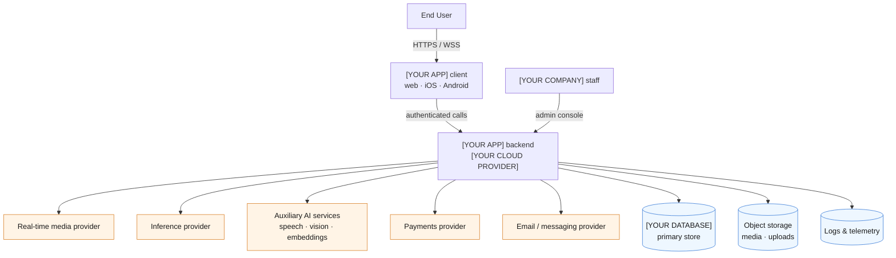
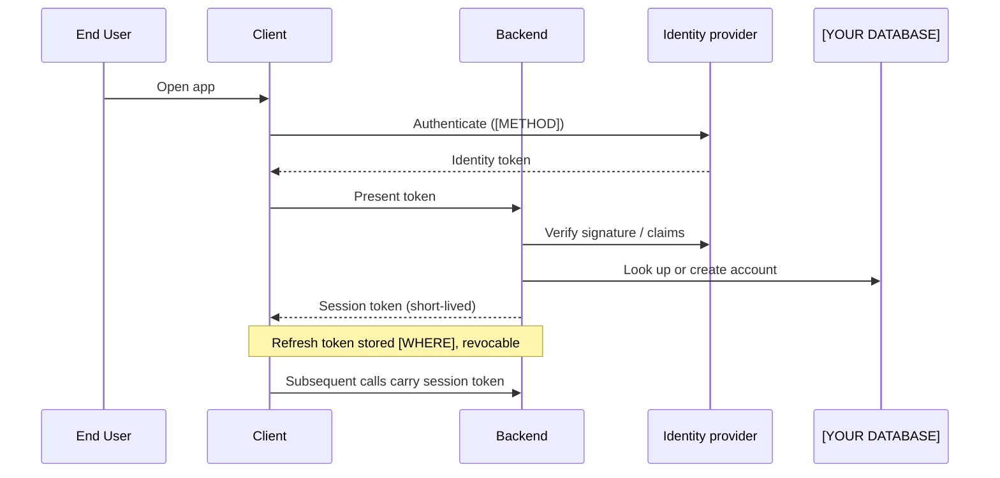
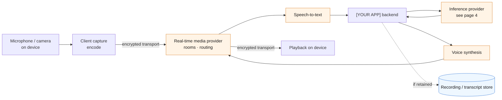
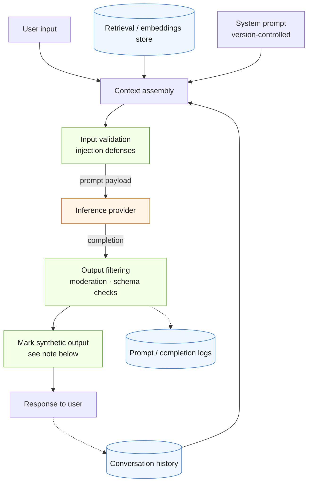
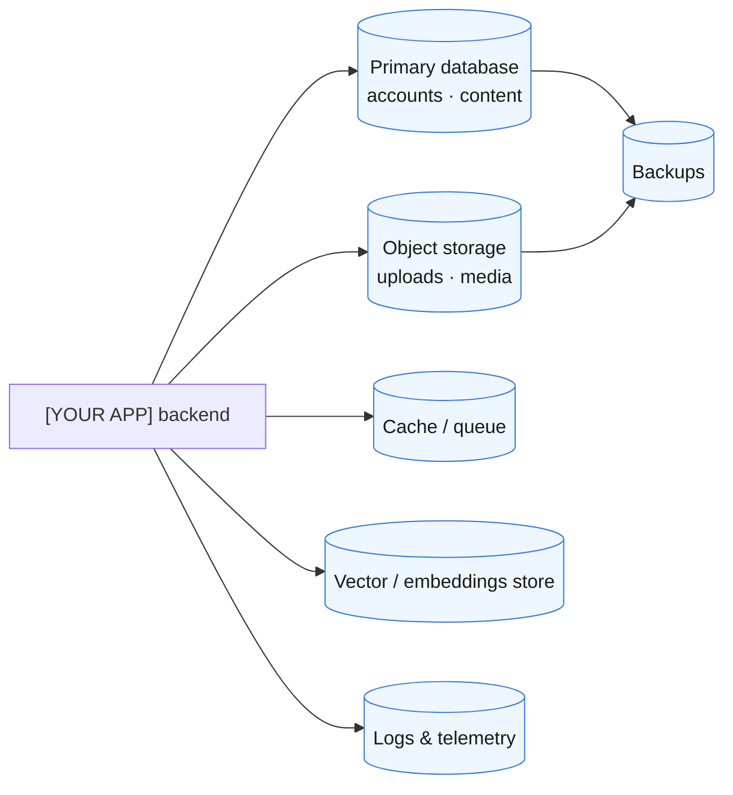
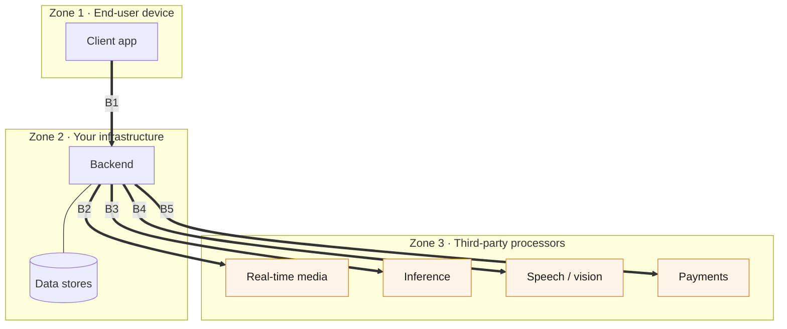
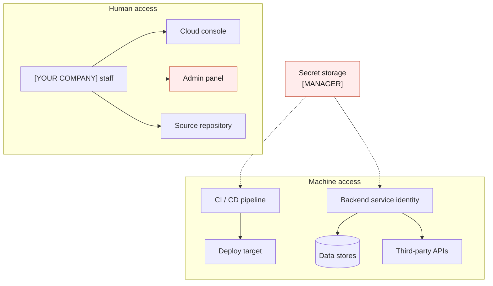
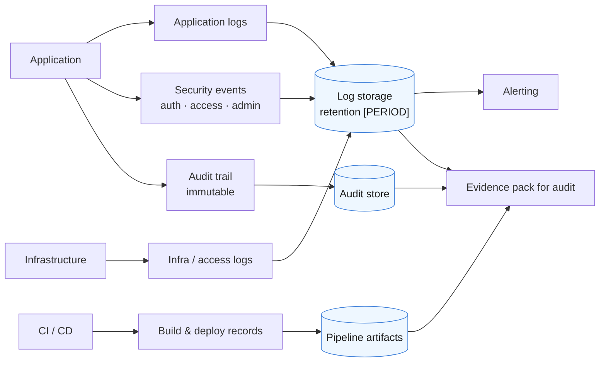

# Architecture Map

**Company:** [YOUR COMPANY]
**Application:** [YOUR APP]
**Version:** 1.0
**Effective Date:** [DATE]
**Last Updated:** [DATE]
**Owner:** [YOUR NAME]

---

## What This Is

Eight views of how customer data moves through an AI product, from the client app through real-time media, inference, and storage. Fill it in once and it answers the question an auditor opens with, which is some version of "show me where the data goes."

It also feeds four other templates in this kit, so filling this in first saves work later:

| This map gives you | Which fills in |
|---|---|
| Every external party that touches data (page 6) | `SUBPROCESSOR-TABLE.md` |
| Every store and its retention (page 5) | `DATA-RETENTION-POLICY.md` |
| Every trust boundary crossing (page 6) | `RISK-REGISTER.md` |
| Every credential and where it lives (page 7) | `SECRETS-AUDIT-CHECKLIST.md` |
| Every log and evidence source (page 8) | `SOC2-CONTROL-MAPPING.md` |

**On the diagrams.** They're [Mermaid](https://mermaid.js.org/), which GitHub renders in the browser. Edit the text and the picture changes; no design tool, no binary file, and a diff that shows what moved. If you'd rather draw them somewhere else, keep the tables. The tables are what an auditor reads.

<!-- CUSTOMIZE: Delete any page that does not apply to your product. A text-only chat app has no page 3. Say in the notes why a page was removed, since an empty section reads as an oversight and a removed one reads as a decision. -->

---

## How to Fill This In

1. Start with page 1 and get it roughly right. Do not aim for complete.
2. Walk one real user action end to end (a signup, a conversation, a file upload) and mark every hop it makes. Most missing pieces surface this way.
3. Fill pages 2 through 5 from that walk.
4. Do page 6 last among the flow pages. It is derived, and it is the one that matters most.
5. Pages 7 and 8 describe the machinery around the flow rather than the flow itself.

**Time:** about half a day for a solo founder who knows the system. Longer if you find something you didn't know was there, which is common and is one of the reasons to do it.

---

# Page 1: System Context

The whole product on one page. Anyone should be able to read this without knowing your stack.

**Legend.** Orange is outside your control. Blue is a data store you own. Everything else is your code.

### System Inventory

| # | Component | Owner | Hosted where | Customer data? | Notes |
|---|---|---|---|---|---|
| 1 | Client app | You | End-user device | Yes | [PLATFORMS] |
| 2 | Backend / API | You | [YOUR CLOUD PROVIDER] | Yes | |
| 3 | Primary database | You | [YOUR DATABASE] | Yes | |
| 4 | Object storage | You | [PROVIDER] | Yes | |
| 5 | Real-time media provider | Third party | [REGION] | Yes | See page 3 |
| 6 | Inference provider | Third party | [REGION] | Yes | See page 4 |
| 7 | [ADD ROWS] | | | | |

**Auditor asks here:** "Is this current?" Put the review date in the header and mean it.

---

# Page 2: Client and Session Establishment

How a user gets from opening the app to holding an authenticated session. Access control questions live here.

### Session and Access Facts

| Question | Your answer |
|---|---|
| Authentication method | [PASSWORD / OAUTH / PASSKEY / DEVICE ID] |
| Is MFA available? Enforced for staff? | [ANSWER] |
| Session token lifetime | [DURATION] |
| Refresh token lifetime and storage | [DURATION], stored [WHERE] |
| How is a token revoked? | [MECHANISM] |
| Anonymous or guest use supported? | [YES / NO. If yes, what identifies them?] |
| Where do staff/admin sessions differ? | [ANSWER] |

<!-- CUSTOMIZE: If you support guest or anonymous sessions, say what identifier ties data to a person. Auditors and privacy regulators both ask, and "device ID" is an answer with consequences. -->

**Auditor asks here:** how a departing employee loses access, and how fast.

---

# Page 3: Real-Time Media Path

Voice, video, and streaming audio. Real-time media gets its own page because its data stays in flight for the length of a session, often passes through a third party, is sometimes recorded, and in several jurisdictions it is biometric.

<!-- CUSTOMIZE: Delete this page if your product is text-only. -->

### Media Handling Facts

| Question | Your answer |
|---|---|
| Is raw audio or video persisted at all? | [YES / NO] |
| If yes, where, for how long, encrypted how? | [ANSWER] |
| Are transcripts persisted separately from audio? | [ANSWER] |
| Does the media provider retain anything? For how long? | [ANSWER, FROM THEIR DPA] |
| Does the speech provider retain or train on audio? | [ANSWER] |
| Is any voice data used for speaker identification? | [YES / NO] |
| Which jurisdictions treat this as biometric data? | [SEE NOTE] |

**On biometric classification.** Voice audio becomes biometric data in most laws only when it is turned into, or can yield, something that identifies the speaker. Under the GDPR (Article 9), voice is special-category data when processed to uniquely identify someone. Illinois BIPA and Texas CUBI cover voiceprints and list no recordings; since 2026-01-01 Texas also exempts voiceprints used to develop or offer AI systems unless the system is used to identify people. Connecticut excludes recordings unless data from them is generated to identify someone, and Washington's biometric law excludes recordings and the data generated from them. Colorado treats a voiceprint, or other data that can be processed to uniquely identify someone, as a "biometric identifier", with notice and deletion duties at any volume since 2025-07-01. California and Washington's My Health My Data Act count a recording from which a voiceprint can be extracted. So the deciding question is whether you or a vendor create a voiceprint or speaker model from the audio. Write down which one you are and why. Children's audio is the exception: under COPPA, audio kept only to answer a child's request must be deleted immediately.

**Auditor asks here:** what happens to audio when a user deletes their account. Trace it to every box on this page, including the provider's own retention.

---

# Page 4: Inference and Generation Path

What leaves your system in a prompt, what comes back, and what you do to it before a user sees it.

### Inference Facts

| Question | Your answer |
|---|---|
| Which provider and model, for which feature? | [ANSWER] |
| What customer data goes into a prompt? | [BE SPECIFIC] |
| Is data used to train the provider's models? | [ANSWER, AND WHERE IT SAYS SO IN WRITING] |
| Provider retention default for prompts | [DAYS] |
| Is Zero Data Retention enabled? Supported, or the default on your tenant? | [ANSWER] |
| Are prompts and completions logged on your side? | [YES / NO, RETENTION] |
| Do logs contain customer content? | [YES / NO] |
| Is the system prompt version-controlled? | [ANSWER] |
| Is there a fallback if the provider is down? | [ANSWER] |

<!-- CUSTOMIZE: Training opt-out and retention are two different controls. Opting out of training does not stop a provider storing your inputs. Answer both rows separately; a single "we opted out" is the answer that gets challenged. -->

**On marking generated output.** Several jurisdictions require AI-generated content to be marked so it can be detected as synthetic, and some require a visible label as well as a machine-readable one. The `MARK` step is in this diagram because retrofitting it later means touching every output path. See `SOC2-GUIDE.md`, "Telling People They Are Talking to AI," for which rules apply where and by when.

**Auditor asks here:** what stops a user's prompt from reaching another user's data. Point at the isolation mechanism, not at the intent.

---

# Page 5: Data Stores and Retention

Every place customer data comes to rest.

### Store Inventory

| Store | What lives here | Encrypted at rest | Retention | Deleted on account deletion? | Notes |
|---|---|---|---|---|---|
| Primary database | [DATA TYPES] | [YES / NO, METHOD] | [PERIOD] | [YES / NO] | |
| Object storage | [DATA TYPES] | [YES / NO] | [PERIOD] | [YES / NO] | |
| Cache / queue | [DATA TYPES] | [YES / NO] | [TTL] | [N/A?] | Often overlooked |
| Vector / embeddings | [DATA TYPES] | [YES / NO] | [PERIOD] | [YES / NO] | See note |
| Logs & telemetry | [DATA TYPES] | [YES / NO] | [PERIOD] | [USUALLY NO] | See note |
| Backups | [SCOPE] | [YES / NO] | [PERIOD] | [SEE NOTE] | See note |
| [ADD ROWS] | | | | | |

**Three stores that break deletion promises.** Backups, logs, and embeddings are where "we delete your data" usually stops being true.

- **Backups** hold deleted records until the backup ages out. That is defensible; state the window in your privacy policy rather than claiming immediate erasure.
- **Logs** frequently contain content nobody meant to persist. Check what you actually log before answering.
- **Embeddings** derived from customer content are generally treated as personal data by regulators, so a vector left behind after deletion is a live gap.

**Auditor asks here:** show the deletion actually running. A documented procedure with no execution evidence is the most common finding.

---

# Page 6: Trust Boundaries and Data Classification

The most important page. Every line crossing a boundary is a subprocessor relationship, a DPA, and a risk-register row.

### Boundary Register

| ID | Crossing | Data classes crossing | Protection in transit | DPA signed | Provider SOC 2 | Their retention |
|---|---|---|---|---|---|---|
| B1 | Device → your backend | [CLASSES] | TLS [VERSION] | N/A | N/A | N/A |
| B2 | Backend → real-time media | [CLASSES] | [PROTOCOL] | [DATE] | [TYPE / NONE] | [PERIOD] |
| B3 | Backend → inference | [CLASSES] | TLS [VERSION] | [DATE] | [TYPE / NONE] | [PERIOD] |
| B4 | Backend → speech / vision | [CLASSES] | TLS [VERSION] | [DATE] | [TYPE / NONE] | [PERIOD] |
| B5 | Backend → payments | [CLASSES] | TLS [VERSION] | [DATE] | [TYPE / NONE] | [PERIOD] |
| [ADD ROWS] | | | | | | |

### Data Classification

| Class | Examples in [YOUR APP] | Handling rule |
|---|---|---|
| Public | [EXAMPLES] | No restriction |
| Internal | [EXAMPLES] | Staff only |
| Customer content | [EXAMPLES] | Encrypted, access-logged |
| Sensitive / special category | [VOICE, HEALTH, BIOMETRIC, ETC.] | [STRICTER RULE] |
| Secrets | API keys, tokens | See page 7 |

**Every row in the boundary register should appear in `SUBPROCESSOR-TABLE.md`.** If the two disagree, one of them is wrong, and it is worth finding out which before an auditor does.

**Auditor asks here:** "Is this everyone?" Shadow integrations added for a demo and never removed are the usual gap.

---

# Page 7: Identity, Access, and Secrets

Who and what can reach each component, and where credentials live.

### Access and Secrets Facts

| Question | Your answer |
|---|---|
| Where are production secrets stored? | [MANAGER / ENV VARS / OTHER] |
| Are any secrets in source control? | [NO, AND HOW YOU VERIFIED] |
| Is secret scanning running in CI? | [ANSWER] |
| Who can reach production data? | [LIST ROLES, INCLUDING YOURSELF] |
| Is admin access separately authenticated? | [ANSWER] |
| Are admin actions audit-logged? | [ANSWER] |
| Rotation schedule per credential class | [ANSWER] |
| Offboarding checklist exists? | [ANSWER] |

<!-- CUSTOMIZE: As a solo founder you are every role here. Write your own name in each one. Documenting that you hold the access and accept the responsibility is the control; pretending a separation exists is not. -->

**Auditor asks here:** evidence of the last access review. A quarterly review with three dated entries beats an annual one with none.

---

# Page 8: Logging, Monitoring, and Evidence

Where the proof comes from when someone asks you to demonstrate a control.

### Evidence Sources

| Control area | Evidence source | Retention | Where it lives |
|---|---|---|---|
| Authentication events | [SOURCE] | [PERIOD] | [LOCATION] |
| Access reviews | [SOURCE] | [PERIOD] | [LOCATION] |
| Change management | [SOURCE] | [PERIOD] | [LOCATION] |
| Vulnerability scanning | [SOURCE] | [PERIOD] | [LOCATION] |
| Data deletion events | [SOURCE] | [PERIOD] | [LOCATION] |
| Incident records | [SOURCE] | [PERIOD] | [LOCATION] |
| Vendor assessments | [SOURCE] | [PERIOD] | [LOCATION] |
| AI transparency assessment | [SOURCE] | [PERIOD] | [LOCATION] |

**A Type II report needs history.** Evidence has to span the observation window, so a pipeline switched on a month before the audit produces a month of evidence. Your CI workflows start accumulating from the day you enable them, which is the argument for enabling them early even if the audit is a year out.

**Auditor asks here:** an audit trail that the person being audited cannot edit. Say plainly whether yours qualifies.

---

## Review and Sign-Off

<!-- CUSTOMIZE: This map goes stale faster than any other document in the kit, because adding one vendor invalidates pages 1 and 6. Tie the review to your change process rather than to a calendar. -->

| Trigger | Action |
|---|---|
| New third-party integration | Update pages 1 and 6 before shipping |
| New data store | Update pages 5 and 6 |
| New AI feature or model change | Update page 4 |
| Quarterly | Full review of all eight pages |
| Before an audit | Confirm every table has real values and no placeholders remain |

| Reviewed by | Role | Date |
|---|---|---|
| [YOUR NAME] | [ROLE] | [DATE] |

**Before you call this done,** search the file for `[` and confirm nothing is left unfilled. A map with placeholders in it tells an auditor the exercise was not finished.
